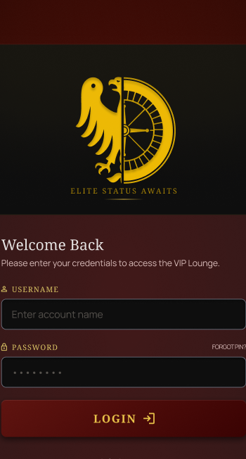
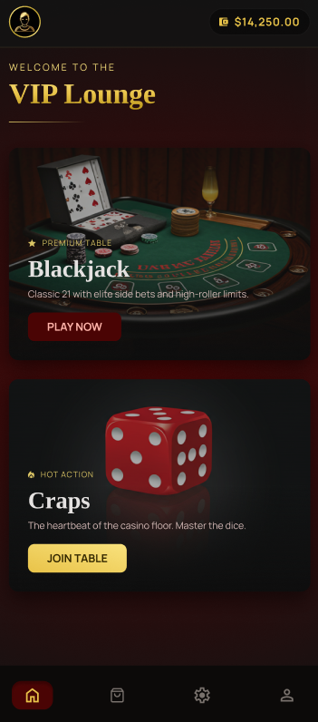
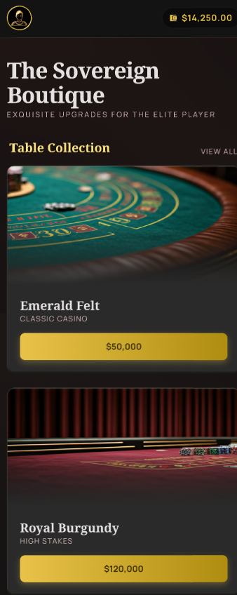
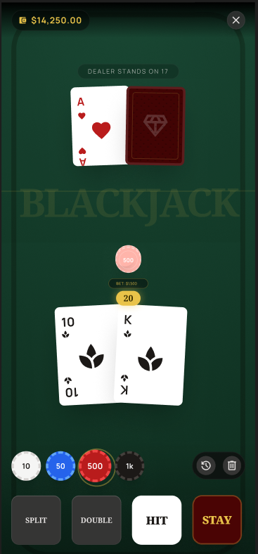
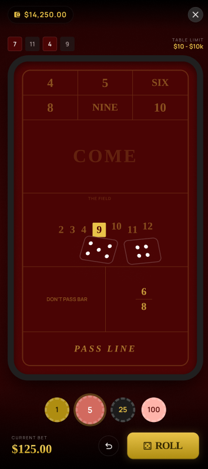
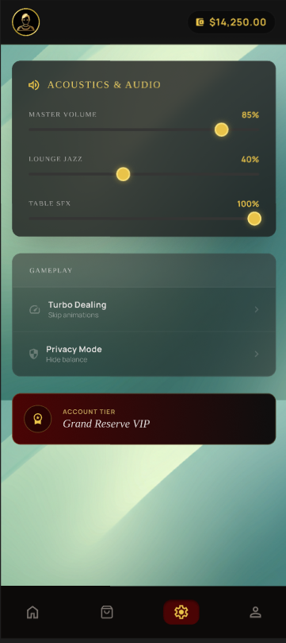
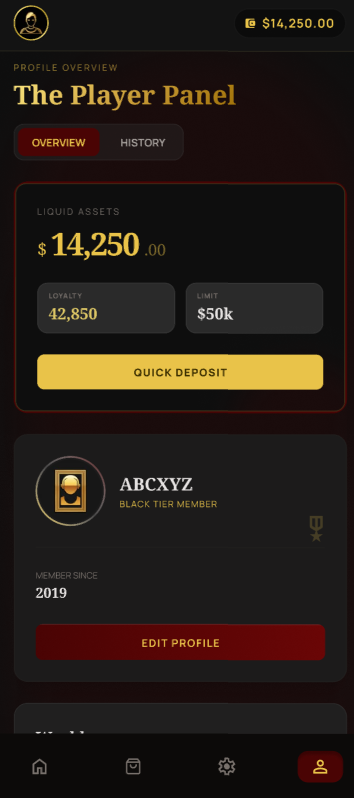

# RGS — Game Room 🎰

Mobilna aplikacja symulująca gry losowe na Androida napisana w Kotlinie.
Projekt demonstrujący stos Androida: **Jetpack Compose**, architekturę **MVVM** oraz lokalną bazę danych **Room**.

Gracz zakłada konto, dostaje wirtualny portfel monet i gra w **Blackjacka** oraz **Craps**,
kupuje kosmetyczne motywy w sklepie, śledzi statystyki i historię rozgrywek na swoim profilu.

> Wszystkie środki w grze są wirtualne — aplikacja nie obsługuje płatności ani prawdziwych pieniędzy.

---

## Spis treści

- [Funkcje](#funkcje)
- [Architektura](#architektura)
- [Kluczowe klasy aplikacji](#kluczowe-klasy-aplikacji)
- [ViewModele — opis i odpowiedzialności](#viewmodele--opis-i-odpowiedzialności)
- [Dodatkowe funkcjonalności](#dodatkowe-funkcjonalności)
- [Model danych](#model-danych)
  - [Baza danych i tabele](#baza-danych-i-tabele)
  - [Repozytoria danych](#repozytoria-danych)
- [Struktura projektu](#struktura-projektu)
- [Makiety ekranów](#makiety-ekranów)
- [Uruchomienie](#uruchomienie)

---

## Funkcje

- **Konta i logowanie** — rejestracja i logowanie z haszowaniem hasła (SHA-256). Sesja jest
  trwała (przeżywa restart aplikacji) dzięki DataStore.
- **Gry:**
  - **Blackjack** — klasyczne 21 z akcjami *Hit / Stand / Double Down / Split*, dobieraniem
    krupiera do 17 i wypłatą 2.5× za blackjacka.
  - **Craps** — zakład *Pass Line* / *Don't Pass* z fazami *come-out* i *point*, animowanym
    rzutem kości i historią rzutów.
- **Portfel i ekonomia** — każdy gracz startuje z saldem 10 000 monet; zakłady i wygrane
  aktualizują portfel reaktywnie.
- **System „pity"** — gdy saldo spadnie poniżej progu (10 monet), aplikacja automatycznie
  dolewa 100 monet, żeby gracz mógł grać dalej.
- **Sklep** — kosmetyczne motywy stołów i talii (Blackjack) oraz stołów i kości (Craps).
  Kupione przedmioty można zakładać; wybrany motyw zmienia wygląd stołu w grze.
- **Profil** — nazwa użytkownika, data dołączenia, saldo, zagregowane statystyki
  (rozegrane gry, wygrane, przegrane, win-rate, wynik netto) oraz rozwijana historia gier.
- **Ustawienia i dźwięk** — regulacja głośności głównej i muzyki; muzyka w tle odtwarzana
  przez dedykowany `MusicManager`.

---

## Architektura

Aplikacja realizuje wzorzec **MVVM** z jednokierunkowym przepływem danych (UDF):

```
        ┌──────────────────────────────────────────────┐
        │  View  (Jetpack Compose, @Composable)        │
        │  AuthScreen, MainMenuScreen, BlackjackScreen,│
        │  CrapsScreen, ShopScreen, SettingsScreen,    │
        │  ProfileScreen                               │
        └───────────────────────────────┬──────────────┘
                        ▲               │
            collectAsState()      wywołania akcji
                        │               ▼
        ┌──────────────────────────────────────────────┐
        │  ViewModel  (StateFlow<UiState>)             │
        │  trzyma stan ekranu, logikę gry i akcje      │
        └──────────────────────────────┬──────────────┘
                        ▲              │
                        │              ▼
        ┌──────────────────────────────────────────────┐
        │  Model / Data  (Repository → DAO → Room)     │
        │  UserRepository, GameRepository, AppDatabase │
        └──────────────────────────────────────────────┘
```

- **View** nie zawiera logiki biznesowej — obserwuje `StateFlow` z ViewModelu i wywołuje
  jego metody w reakcji na zdarzenia użytkownika.
- **ViewModel** wystawia niemutowalny stan UI i komunikuje się z warstwą danych przez
  repozytoria/DAO.
- **Service locator** — klasa `RgsApplication` tworzy pojedyncze instancje bazy, repozytoriów,
  `SessionManager` i `MusicManager` (lazy initialization), a ViewModele dostają je przez
  własną `Factory`.
- **Nawigacja** — `AppRoot` z `NavHost` (ekrany: `auth`, `main_menu`, `blackjack`, `craps`).
  Przejścia między stołami a menu są maskowane efektem `CurtainTransition` (animowana kurtyna).

---

## Kluczowe klasy aplikacji

| Klasa | Pakiet | Rola |
|-------|--------|------|
| `RgsApplication` | `com.atpp.rgs` | Klasa `Application`. Pełni rolę prostego **service locatora** — tworzy lazy instancje `AppDatabase`, `UserRepository`, `GameRepository`, `SessionManager` i `MusicManager`. |
| `MainActivity` | `com.atpp.rgs` | Punkt wejścia UI — osadza Compose i renderuje `AppRoot`. |
| `AppRoot` | `com.atpp.rgs.ui` | Główny kontener nawigacji. Obserwuje `SessionManager.currentUserId` — jeżeli brak userId, kieruje na ekran `auth`, w przeciwnym razie na `main_menu`. Steruje też efektem kurtyny przy zmianie ekranu. |
| `AppDatabase` | `com.atpp.rgs.data` | Klasa `RoomDatabase` (wersja **2**). Wystawia wszystkie DAO, definiuje **migrację 1→2** dodającą tabele sklepu oraz **callback seedujący** katalog gier (`Blackjack`, `Craps`). |
| `Converters` | `com.atpp.rgs.data` | `TypeConverters` Roomowe — mapowanie `Date` ↔ `Long` (timestamp). |
| `GameHistoryRow` | `com.atpp.rgs.data` | Data class — projekcja JOIN-a `game_session × games × game_results`, używana w historii gier (nie jest encją Room). |
| `SessionManager` | `com.atpp.rgs.session` | Trzyma identyfikator zalogowanego użytkownika w **DataStore Preferences**. Wystawia `Flow<Int?>` (`currentUserId`) oraz `login(id)` / `logout()`. Dzięki temu sesja przeżywa restart aplikacji. |
| `MusicManager` | `com.atpp.rgs.audio` | Owija `MediaPlayer` odtwarzający muzykę w tle z assetów. Trzyma `masterVolume` i `musicVolume` w DataStore (`settings`), reaktywnie aplikuje głośność (`master × music`), zapewnia `start/pause/resume/release`. |
| `MediaAssets` | `com.atpp.rgs.media` | Helper do dostępu do plików w katalogu `assets/` (np. `audioFd(...)` dla `MusicManager`). |
| `PasswordHasher` | `com.atpp.rgs.util` | Statyczny haszer **SHA-256** (`hash`, `verify`). Hasło nigdy nie trafia do bazy w postaci jawnej. |
| `Card`, `Suit`, `Rank` | `com.atpp.rgs.model` | Model domenowy karty + funkcja `calculateScore(hand)` obsługująca elastyczną wartość Asa (11/1). |
| `CurtainTransition` | `com.atpp.rgs.ui.misc` | Composable — animowana „kurtyna VIP" maskująca przejścia nawigacyjne. |
| `ThemeConfig` (`TableTheme`, `CrapsTheme`, `THEME_REGISTRY`, `CRAPS_THEME_REGISTRY`) | `com.atpp.rgs.ui.misc` | Słowniki palet kolorów dla kosmetycznych motywów stołów (Blackjack i Craps). |
| `SHOP_CATALOG`, `ShopItem`, `ItemCategory` | `com.atpp.rgs.ui.shop` | Statyczny katalog produktów sklepu (stoły BJ, talie BJ, stoły Craps, kości Craps) z ceną, opisem i kluczem assetów. |

---

## ViewModele — opis i odpowiedzialności

Każdy ekran ma własny ViewModel, który wystawia niemutowalny `StateFlow<UiState>`.
Wszystkie ViewModele tworzone są przez statyczne `factory(app, userId)`.

### `AuthViewModel` (`ui/auth/AuthViewModel.kt`)
Logika ekranu logowania/rejestracji.
- Stan: `AuthUiState` (tryb LOGIN/REGISTER, login, hasło, potwierdzenie, `isLoading`, błędy).
- Akcje: `onUsernameChange`, `onPasswordChange`, `onConfirmPasswordChange`, `toggleMode`, `submit`.
- `submit()` waliduje formularz (np. zgodność potwierdzenia hasła) i woła
  `UserRepository.login` / `register`. Po sukcesie zapisuje sesję przez `SessionManager`.

### `MainMenuViewModel` (`ui/menu/MainMenuViewModel.kt`)
Logika ekranu głównego menu (lista gier + portfel).
- Eksponuje listę dostępnych gier (`games: StateFlow<List<GameEntity>>`) i portfel (`wallet`).
- W `init` zapewnia **starter pack** — wstawia podstawowe darmowe przedmioty do `OwnedItemEntity`
  oraz, jeśli gracz nie ma niczego założonego, zakłada domyślne motywy.
- `checkPity()` — sprawdza saldo i, jeśli spadło poniżej progu, woła
  `UserRepository.checkAndGrantPity` (system litości).
- `logout()` — czyści sesję.

### `BlackjackViewModel` (`ui/blackjack/BlackjackViewModel.kt`)
Pełna logika gry w Blackjacka.
- Stan rozdania: `playerHands` (lista rąk po splicie), `currentHandIndex`, `dealerHand`,
  `gameState` (enum `GameState`: NOT_STARTED, DEALING, ACTIVE, DEALER_TURN, PLAYER_WON,
  DEALER_WON, TIE, PLAYER_BUSTED).
- Ekonomia rundy: `balance` i `currentBet` trzymane lokalnie w pamięci — zakład „leży na stole",
  zapis do `WalletDao` następuje **dopiero przy wypłacie** (`payout`).
- Akcje gracza: `placeBet`, `clearBet`, `repeatBet`, `startNewGame`, `hit`, `stand`, `doubleDown`, `split`.
- AI krupiera dobiera do 17, animacje sterowane `delay()`-em w korutynie.
- Wypłaty: blackjack 2.5×, zwykła wygrana 2×, push 1×, bust 0×. Po rundzie woła
  `GameRepository.recordRound` (statystyki + historia).
- **Reaktywne motywy** — `currentTheme` i `currentDeckPrefix` pobierane z `ShopDao.getEquippedItems`
  i mapowane przez katalog → automatycznie odświeżają wygląd stołu przy zmianie w sklepie.

### `CrapsViewModel` (`ui/craps/CrapsViewModel.kt`)
Pełna logika gry w Craps.
- Stan: `CrapsUiState` (saldo, faza `COME_OUT`/`POINT`, point, mapa zakładów `tableBets`,
  historia żetonów `chipHistory`, wybrana wartość żetonu, wartości kości, historia rzutów, wynik rundy).
- Obsługa zakładów (staged in-memory): `selectChip`, `placeBet(BetType)`, `undoLastChip`,
  `clearBet`, `repeatBet`. Zakłady `PASS_LINE` i `DONT_PASS` wzajemnie się wykluczają.
- `roll()` — losuje 10 „animacyjnych" wartości kości z `delay`, potem wylicza wynik.
- `processResult` realizuje reguły:
  - **Come-out**: 7/11 → Pass wygrywa; 2/3 → Don't Pass wygrywa; 12 → Don't Pass push;
    inne → ustawia *point*.
  - **Point**: trafienie point → Pass wygrywa; siódemka → Don't Pass wygrywa.
- Po zakończonej rundzie aktualizuje portfel (`WalletDao.changeCoins`) i woła
  `GameRepository.recordRound`.
- Reaktywne motywy: `currentTheme` (stół) i `currentDicePrefix` (kości).

### `ShopViewModel` (`ui/shop/ShopViewModel.kt`)
Sklep z kosmetycznymi przedmiotami.
- Stany: `balance`, `ownedItems: Set<String>` (id posiadanych), `equippedItems: Map<category,id>`.
- `buyItem(item)` — woła **transakcyjny** `ShopDao.buyItemTransaction` (atomowe odjęcie monet
  + wstawienie własności, transakcja odpada jeśli brak środków). Po zakupie od razu zakłada
  przedmiot.
- `equipItem(item)` — wstawia/aktualizuje wpis w `equipped_items` (klucz: użytkownik + kategoria).

### `ProfileViewModel` (`ui/profile/ProfileViewModel.kt`)
Ekran profilu z agregatami i historią.
- Łączy 4 strumienie (`combine`): dane usera, portfel, statystyki, historię gier.
- Wystawia `ProfileUiState` (login, data rejestracji, saldo, totalGames/Wins/Loses,
  `winRate`, `netResult` = earned − lost, lista `GameHistoryRow`).
- `logout()` — czyści sesję.

### `SettingsViewModel` (`ui/settings/SettingsViewModel.kt`)
Mały ViewModel ustawień — wystawia `masterVolume` i `musicVolume` z `MusicManager` oraz
metody `setMasterVolume`, `setMusicVolume` (zapis do DataStore).

---

## Dodatkowe funkcjonalności

- **Uwierzytelnianie i bezpieczeństwo haseł** — hasło nigdy nie jest zapisywane jawnie.
  `PasswordHasher` używa `MessageDigest("SHA-256")`. Walidacja długości i unikalności loginu
  w `UserRepository`. (Uwaga: implementacja jest *projektowa* — bez soli ani KDF, nieprzeznaczona
  na produkcję.)
- **Trwała sesja** — `SessionManager` używa **DataStore Preferences** do przechowania `current_user_id`.
  `AppRoot` reaktywnie reaguje na zmianę: brak userId → ekran logowania.
- **Atomowe transakcje sklepu** — `ShopDao.buyItemTransaction` opakowuje odjęcie monet
  (`UPDATE ... WHERE coins >= :price`) i wstawienie własności w jedną transakcję Roomową.
  Zapobiega to „kupieniu za pożyczone monety" przy współbieżności.
- **System „pity"** — `UserRepository.checkAndGrantPity` automatycznie dolewa 100 monet,
  gdy saldo spadnie poniżej 10. Wywoływane z `MainMenuViewModel.checkPity()` po powrocie do menu.
- **Reaktywny dźwięk** — `MusicManager` nasłuchuje DataStore `combine(masterVolume, musicVolume)`
  i bez resetu odtwarzania na bieżąco aktualizuje głośność.
- **Migracja schematu** — `AppDatabase.MIGRATION_1_2` zachowuje dane istniejących użytkowników
  przy dodaniu tabel sklepu (`owned_items`, `equipped_items`).
- **Seed katalogu gier** — `Callback` Roomowy podczas tworzenia (i otwarcia, jeśli pusto) bazy
  wstawia rekordy `Blackjack` i `Craps` do tabeli `games`.
- **Brak współpracy z usługami webowymi** — projekt jest w pełni offline, cała persystencja
  to lokalne Room + DataStore.

---

## Model danych

### Baza danych i tabele

Baza `rgs.db` (Room, wersja schematu **2**, `exportSchema = false`).

| Encja / tabela | Klucz | Najważniejsze kolumny | Opis |
|----------------|-------|-----------------------|------|
| `UserEntity` / `users` | `id` (auto) | `username`, `password_hash`, `created_at` | Konto użytkownika; hasło jako hash SHA-256. |
| `WalletEntity` / `wallets` | `user_id` (FK → users, CASCADE) | `coins` (domyślnie 10 000), `updated_at` | Portfel **1:1** z użytkownikiem. |
| `GameEntity` / `games` | `id` (auto) | `name`, `description` | Katalog gier — seedowany (Blackjack, Craps). |
| `GameResultsEntity` / `game_results` | `id` (auto) | `name` | Słownik wyników rundy (`WIN` / `LOSE` / `PUSH`); wartości tworzone on-demand. |
| `GameSessionEntity` / `game_session` | `id` (auto) | `user_id`, `game_id`, `result_id`, `bet_amount`, `played_at` | Pojedyncza rozegrana runda. FK: user CASCADE, game CASCADE, result SET_NULL. |
| `GameStatsEntity` / `game_statistics` | (`user_id`, `game_id`) | `total_games`, `total_wins`, `total_loses`, `earned_amount`, `lost_amount`, `updated_at` | Zagregowane statystyki per gracz × gra. |
| `TransactionsEntity` / `transactions` | `id` (auto) | `user_id`, `game_session_id?`, `amount`, `type`, `created_at` | Rejestr transakcji portfela (`WIN`/`LOSS`/`BONUS`/`PURCHASE`). |
| `OwnedItemEntity` / `owned_items` | (`userId`, `itemId`) | — | Przedmioty zakupione w sklepie (id z `SHOP_CATALOG`). |
| `EquippedItemEntity` / `equipped_items` | (`userId`, `category`) | `itemId` | Aktualnie założony przedmiot per kategoria (`BJ_TABLE`, `BJ_DECK`, `CRAPS_TABLE`, `CRAPS_DICE`). |

Dodatkowe szczegóły:
- Dostęp przez interfejsy **DAO** (`@Dao`) — większość zwraca `Flow<...>` dla reaktywnego UI.
- **Migracja 1 → 2** dodaje tabele sklepu (`owned_items`, `equipped_items`).
- `Callback` przy tworzeniu bazy **seeduje** listę gier (`Blackjack`, `Craps`).
- Konwertery typów (`Converters`) mapują `Date` ↔ `Long`.
- Zapis salda jest atomowy (`UPDATE wallets SET coins = coins + :amount`), a zakup w sklepie
  działa w transakcji warunkowej (`coins >= :price`).

#### DAO

| DAO | Najważniejsze operacje |
|-----|------------------------|
| `UserDao` | `getUserByUsername`, `insertUser`, `getUserById`, `getAllUsers (Flow)` |
| `WalletDao` | `getWalletByUserId (Flow)`, `getWalletNow`, `insertWallet`, `changeCoins(+/-)`, `deductCoins (warunkowe)` |
| `GameDao` | `getAllGames (Flow)`, `getGameByName`, `insertGame(s)` |
| `GameResultsDao` | `getResultByName`, `insertResultReturningId` |
| `GameSessionDao` | `insertSession`, `getHistoryByUserId` (JOIN → `GameHistoryRow`), `getSessionsByUserId/GameId` |
| `GameStatsDao` | `getStatsByUserId (Flow)`, `getStatsByUserAndGame`, `upsertStats` |
| `TransactionsDao` | `insertTransaction`, `getTransactionsByUserId/SessionId` |
| `ShopDao` | `getOwnedItems`, `getEquippedItems`, `insertOwnedItem`, `equipItem`, **`buyItemTransaction`** (atomowy zakup) |

### Repozytoria danych

#### `UserRepository` (`data/repository/UserRepository.kt`)
Operuje na `UserDao` + `WalletDao`.
- `register(username, password)` — walidacja (puste, min. 4 znaki, unikalność), zapis usera
  z zahaszowanym hasłem i **utworzenie portfela** ze startowym saldem (10 000).
- `login(username, password)` — weryfikuje hash.
- `getUserById(id)` — pobranie danych konta.
- `checkAndGrantPity(userId)` — system litości: jeśli saldo < `PITY_THRESHOLD` (10), dolewa
  `PITY_AMOUNT` (100) i zwraca `true`.
- Zwraca `sealed class AuthResult` (`Success(userId)` / `Error(message)`).

#### `GameRepository` (`data/repository/GameRepository.kt`)
Operuje na `GameDao`, `GameResultsDao`, `GameSessionDao`, `GameStatsDao`.
- `recordRound(userId, gameName, outcome, betAmount, netAmount)` — po każdej rozstrzygniętej
  rundzie zapisuje wpis do `game_session` oraz aktualizuje agregaty w `game_statistics`
  (inkrementuje `totalGames`/`Wins`/`Loses`, sumuje `earnedAmount`/`lostAmount`).
- `history(userId, limit)` → `Flow<List<GameHistoryRow>>` — historia gier dla profilu.
- `stats(userId)` → `Flow<List<GameStatsEntity>>` — statystyki per gra.

ViewModele konsumują repozytoria wyłącznie z poziomu `viewModelScope`.

---

## Struktura projektu

```
RGS/
├─ README.md
└─ App/                         ← projekt Android Studio (Gradle)
   └─ app/src/main/
      ├─ java/com/atpp/rgs/
      │  ├─ RgsApplication.kt    ← service locator
      │  ├─ MainActivity.kt
      │  ├─ data/                ← Room: entity/, dao/,
      │  │                         repository/, AppDatabase, Converters
      │  ├─ session/             ← SessionManager (DataStore)
      │  ├─ audio/               ← MusicManager
      │  ├─ media/               ← dostęp do assetów
      │  ├─ model/               ← modele domenowe (Card, Suit, Rank)
      │  ├─ util/                ← PasswordHasher (SHA-256)
      │  └─ ui/                  ← Compose: auth, menu, blackjack,
      │                            craps, shop, settings, profile,
      │                            theme, components, misc (CurtainTransition,
      │                            ThemeConfig), AppRoot
      └─ res/                    ← zasoby (strings, drawable)
```

---

## Makiety ekranów

Makiety projektowe kluczowych ekranów aplikacji.

| Logowanie | Menu główne | Sklep |
|:---:|:---:|:---:|
|  |  |  |

| Blackjack | Craps | Ustawienia |
|:---:|:---:|:---:|
|  |  |  |

| Profil użytkownika |
|:---:|
|  |

---

## Uruchomienie

Wymagania: **Android Studio** (najnowsza stabilna wersja) oraz JDK 11.

1. Otwórz folder `App/` jako projekt w Android Studio.
2. Poczekaj na synchronizację Gradle (pobranie zależności).
3. Uruchom konfigurację **app** na emulatorze lub urządzeniu z **Androidem 7.0 (API 24)** lub nowszym.
